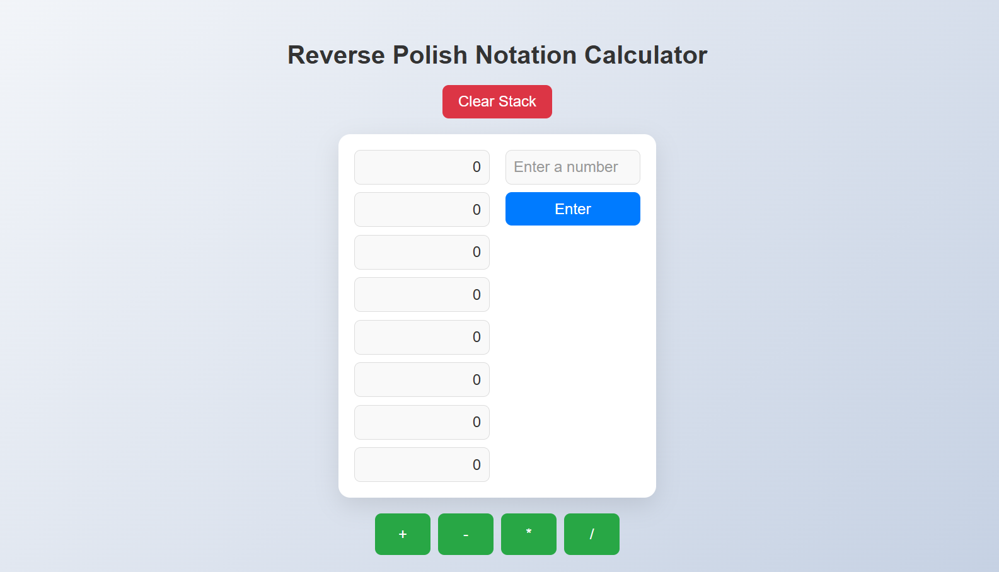

# Reverse Polish Notation (RPN) Calculator

A simple and interactive RPN calculator built using **HTML**, **CSS**, and **JavaScript**.

## Features
- Push numbers to the stack.
- Perform addition (`+`), subtraction (`-`), multiplication (`*`), and division (`/`).
- Clear the stack with a single click.
- Responsive and modern design.

## Live Demo

Try out the live demo of the RPN Calculator here: [Live Demo](https://nikhilpallicode.github.io/rpnCalculator/)

## Screenshot

 <!-- Add a screenshot if you have one -->

## How to Use
1. Enter a number in the input box.
2. Click **Enter** to push the number to the stack.
3. Use the operation buttons (`+`, `-`, `*`, `/`) to perform calculations.
4. Click **Clear Stack** to reset the stack.

## Technologies Used
- **HTML**: For the structure of the calculator.
- **CSS**: For styling and making the calculator visually appealing.
- **JavaScript**: For the logic and functionality.

## License
This project is licensed under the MIT License. See the [LICENSE](LICENSE) file for details.

---

This code contains code for Reverse Polish Notation Calculator
